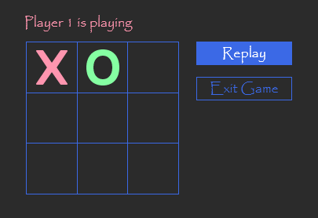

# Tic-Tac-Toe Game

A simple Tic-Tac-Toe game built with Python and PySide6. This project allows two players to play the classic Tic-Tac-Toe game on a graphical interface.

## Features

- Two-player gameplay.
- Interactive GUI built with PySide6.

## Technologies Used

- **Language:** Python 3.11
- **GUI Framework:** PySide6 6.6.1

## Installation

1. **Clone the repository:**

```bash
git clone https://github/Mohammad-Bagamboo/Tic-Tac-Toe.git
```

2. **Install dependencies:**

Ensure you have PySide6 installed. If not, you can install it using pip:

```bash
pip install -r requirements.txt
```

## How to Run the Game

1. Run the game by executing the following command:

```bash
cd tictactoe
python main.py
```

2. The game window will open, and you can start playing by clicking on the cells.

## How to Play

- The game is played on a 3x3 grid.
- Player 1 is "X" and Player 2 is "O".
- Players take turns clicking on the cells to place their symbol.
- The first player to get 3 of their marks in a row (vertically, horizontally, or diagonally) wins the game.
- If all 9 cells are filled without a winner, the game ends in a draw.

## Screenshot





To download the XD file for this UI, [click here](https://t.me/Mohammad_Bagamboo)

## License

This project is licensed under the MIT License.

## Contact

Mohammad Bagamboo | MB

- [Follow me on X](https://x.com/Mohamad_Bagambo)

- [Follow me on Telegram](https://t.me/Mohammad_Bagamboo)

- [Behance](https://MohammadBagamboo)
